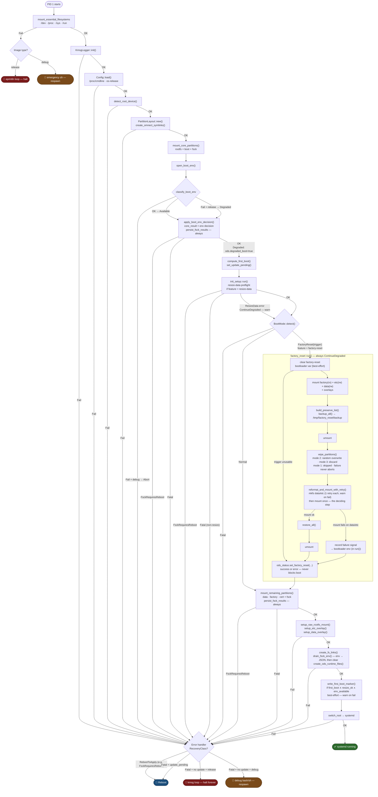
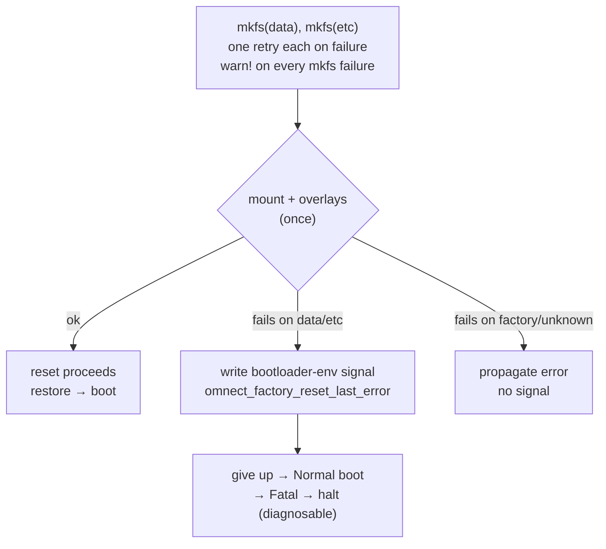

# omnect-os-init

Rust-based init process for omnect-os initramfs.

## Overview

Replaces 14 bash-based initramfs scripts (~1500 LOC) with a single Rust binary
acting as `/init` in the initramfs. Runs as PID 1 before `switch_root`.

Implemented functionality:

- **Bootloader abstraction**: Unified `BootEnv` trait for GRUB (`grub-editenv`) and U-Boot (`fw_printenv`/`fw_setenv`); fsck output persisted across reboots as gzip+base64 in the bootloader env (encoded via busybox `gzip`/`base64` — no crate dependencies)
- **Degraded boot mode**: When the bootloader environment is unavailable (corrupted env file, missing tool, I/O error), release images continue booting and flag `degraded_boot: true` in the ODS status JSON; debug images abort immediately and drop to a shell. `FsckRequiresReboot` always takes precedence over a concurrent bootloader failure.
- **Configuration**: Parses `/proc/cmdline`; build-time constants from Yocto environment via `build.rs`
- **Partition management**: Root device detection, partition layout (GPT/DOS), `/dev/omnect/*` symlinks
- **Filesystem operations**: fsck, mount manager (RAII), overlayfs for `/etc` and `/home`, bind mounts
- **Logging**: Kernel ring buffer (`/dev/kmsg`) with log level prefixes
- **ODS integration**: Runtime files for `omnect-device-service`
- **fs-links**: Symlink creation from `etc/omnect/fs-link.json` and `etc/omnect/fs-link.d/`
- **switch\_root**: MS_MOVE + chroot + exec systemd (`pivot_root(2)` is not used; ramfs does not support it)
- **Factory reset (modes 1-3)**: Selective-preserve backup → wipe `data`/`etc` (modes 2 and 3 only) → reformat → restore, triggered by the `factory-reset` bootloader env key; errors are non-fatal and always fall through to Normal boot (feature `factory-reset`)
- **Flash mode 1**: Clones the running disk onto another block device given by the `flash-mode-devpath` bootloader env key, triggered by `flash-mode`; powers off on success so the clone can be moved to its own device (feature `flash-mode-1`, part of the default feature set)

Not yet implemented (planned):

- Flash modes 2 and 3 (network push, HTTP/HTTPS download)

## Startup Flow

The diagram traces every phase from PID 1 start to `switch_root`. The `release-image`
feature flag determines the error-handling branch at each fatal failure point.



**Terminal states**

| Symbol | Outcome | Trigger |
|--------|---------|---------|
| ✅ | `switch_root` — systemd takes over | Normal completion |
| 🔁 | Reboot | `FsckRequiresReboot` (unconditional); or any fatal error while `omnect_validate_update` is set — triggers bootloader OTA rollback |
| 🔴 | Halt (kmsg loop, infinite) | Fatal error · release image · no OTA in flight |
| 🐚 | Debug shell (bash → sh fallback, respawning) | Fatal error · debug image · no OTA in flight |

**Notes on error handling**

All errors from `run_init()` reach `handle_fatal_error` in `main.rs`, which dispatches on
`RecoveryClass`:
- `RebootToApply` (e.g. `FsckRequiresReboot`) → always Reboot, regardless of image type
- `Fatal` + `omnect_validate_update` set → Reboot (bootloader OTA rollback)
- `Fatal` + no OTA in flight + release → Halt (kmsg loop)
- `Fatal` + no OTA in flight + debug → debug shell

`FsckRequiresReboot` edges in the diagram flow through this handler.

**Notes on overlay, fs-link, and ODS setup (`OVL` / `LINKS` blocks)**

These steps (`setup_raw_rootfs_mount`, `setup_etc_overlay`, `setup_data_overlay`,
`create_fs_links`, `create_ods_runtime_files`) abort the boot on any failure: the error
reaches `handle_fatal_error`, which halts the device on a release image, drops to a debug
shell on a debug image, or reboots when an OTA update is in flight (`update_pending`).
No dedicated design spec covers this region.

**Notes on `apply_boot_env_decision`**

`mount_core_partitions` result is captured rather than propagated immediately so that
fsck diagnostics can be persisted to the bootloader environment before any reboot.
`apply_boot_env_decision` enforces the invariant that `FsckRequiresReboot` always wins
over a concurrent `DegradedBoot` — the two failure modes can co-occur when GRUB's
boot partition is unmountable. `persist_fsck_results` runs on every mount path,
including degraded boot.

**Notes on factory reset (`FRESET` block)**

Enabled by the `factory-reset` feature. `BootMode::detect()` reads the `factory-reset`
bootloader env key; any present value dispatches to `mode::factory_reset::run()` instead of
`mode::normal::run()`. A value the init cannot use is cleared and reported there — status 1
for a problem with `mode`, status 3 for a problem with `preserve` — rather than booting on
in silence, which would leave the caller waiting for a result forever. The reset sequence (mount → backup → wipe → reformat →
mount → restore) always completes with a `FactoryResetStatus` recorded in the ODS status JSON —
success or error — and then falls through into the same `mode::normal::run()` path a
normal boot takes (`MREM` onward), so a failed or unsupported reset never blocks the
device from booting: `FactoryResetError` is classified as `ContinueDegraded`.

**Factory reset — wipe modes (`FWIPE`)**

The trigger must name a `mode` of 1 to 3 and carry a `preserve` array; an empty array keeps
nothing. A file in `/etc/omnect/factory-reset.d` is read for its `paths` array, and one
without a usable `paths` array fails the reset — skipping it would wipe the paths it was
meant to keep and still report success.

The wipe runs once the backup is in initramfs RAM and before the reformat. Mode 2 writes
data from `/dev/urandom`, mode 3 uses the `BLKDISCARD` ioctl, which the hardware has to
support. A failure never aborts the reset — the other partition is still wiped and
reformat + restore still run, so the device stays usable — but the result is reported as
`Error` with a note in the status `error` field, because the wipe the caller asked for did
not happen.

**Factory reset — reformat/mount retry (`FFORMAT`)**

Inside `reformat_and_mount_with_retry`, each of `data`/`etc` is `mkfs`'d with one retry on
failure. The mount is then attempted once and decides the outcome: even after two failed
`mkfs` attempts the mount is still tried, since the filesystem may be usable. A mount failure
on `data`/`etc` is recorded as a bootloader-env signal (`omnect_factory_reset_last_error`), so
even if the following Normal boot halts on the same partition the cause is still readable
(`fw_printenv` / `grub-editenv list`). A mount failure is not re-`mkfs`'d — a repeated `mkfs`
would produce the same filesystem the mount just rejected.



| mkfs | mount | 2nd mkfs? | `warn!` | bootloader signal | ODS status | boot |
|------|-------|-----------|---------|-------------------|------------|------|
| ok | ok | no | no | no | `Success` | normal |
| 1× fail, then ok | ok | yes | yes | no | `Warning` + note | normal |
| 2× fail | ok | yes | yes | no | `Error` + note | normal |
| 2× fail | fails | yes | yes | **yes** | `Error` | halt |
| ok | fails (data/etc) | no | yes | **yes** | `Error` | halt |

The `mkfs` history is reported in the ODS status even when the mount succeeds: a recovered
single failure is `Warning`, two failures are `Error` — an early sign of failing storage.


## Building

```bash
# Debug build (bootloader type and partition table must both be specified)
cargo build --features grub,<gpt|dos>     # x86-64 EFI targets
cargo build --features uboot,<gpt|dos>    # ARM targets

# Release build (optimized for size)
cargo build --release --features grub,<gpt|dos>
cargo build --release --features uboot,<gpt|dos>

# With additional optional features
cargo build --release --features "grub,<gpt|dos>,persistent-var-log"
```

## Features

| Feature | Description | Status |
|---------|-------------|--------|
| `core` | Core boot sequence (default) | Implemented |
| `grub` | GRUB bootloader support — x86-64 EFI targets | Implemented |
| `uboot` | U-Boot bootloader support — ARM targets | Implemented |
| `gpt` | GPT partition table layout | Implemented |
| `dos` | DOS/MBR partition table layout | Implemented |
| `persistent-var-log` | Bind-mount `/var/log` to data partition | Implemented |
| `release-image` | Release error handling: loop on fatal error; continue in degraded boot | Implemented |
| `resize-data` | Data partition auto-resize on first boot | Implemented |
| `test-utils` | Expose `MockBootEnv` for integration tests (never enabled in production) | Test only |
| `factory-reset` | Factory reset support (modes 1-3: selective-preserve backup → wipe → reformat → restore) | Implemented |
| `flash-mode` | Shared flash layer: trigger detection, dispatch, log capture. Pulled in by a mode feature, never selected on its own | Implemented |
| `flash-mode-1` | Disk cloning (part of the default feature set) | Implemented |
| `flash-mode-2` | Network flashing | Planned |
| `flash-mode-3` | HTTP/HTTPS flashing | Planned |

> **Note:** `grub` and `uboot` are mutually exclusive, and so are `gpt` and `dos`.
> Exactly one of each pair must be set at build time — `build.rs` panics otherwise.
> The Yocto recipe selects the correct features via `CARGO_FEATURES` based on `MACHINE_FEATURES`.
> `flash-mode-1` is in the default feature set, so it is already enabled in the
> `cargo build` examples above; add `--no-default-features` to build without it.

## Testing

```bash
# All four valid base combinations (bootloader × partition table)
# test-utils is required to include the degraded_boot integration tests
cargo test --features grub,gpt,test-utils
cargo test --features grub,dos,test-utils
cargo test --features uboot,gpt,test-utils
cargo test --features uboot,dos,test-utils

# With factory-reset feature
cargo test --features grub,gpt,factory-reset,test-utils
cargo test --features grub,dos,factory-reset,test-utils
cargo test --features uboot,gpt,factory-reset,test-utils
cargo test --features uboot,dos,factory-reset,test-utils

# With resize-data feature
cargo test --features grub,gpt,resize-data,test-utils
cargo test --features grub,dos,resize-data,test-utils
cargo test --features uboot,gpt,resize-data,test-utils
cargo test --features uboot,dos,resize-data,test-utils

# With release-image feature
cargo test --features grub,gpt,release-image,test-utils
cargo test --features grub,dos,release-image,test-utils
cargo test --features uboot,gpt,release-image,test-utils
cargo test --features uboot,dos,release-image,test-utils

# With both resize-data and release-image
cargo test --features grub,gpt,resize-data,release-image,test-utils
cargo test --features uboot,gpt,resize-data,release-image,test-utils

# Flash mode 1 (already covered above too: flash-mode-1 is in the default
# feature set, so every "base" combination already includes it — these list
# it explicitly against every bootloader × partition-table pair, plus the
# one combination that also needs factory-reset to compile the
# conflicting-trigger refusal path)
cargo test --features grub,gpt,flash-mode-1,test-utils
cargo test --features grub,dos,flash-mode-1,test-utils
cargo test --features uboot,gpt,flash-mode-1,test-utils
cargo test --features uboot,dos,flash-mode-1,test-utils
cargo test --features uboot,gpt,flash-mode-1,factory-reset,test-utils

# Without any flash feature: flash-mode-1 is in the default set, so
# --no-default-features is required to exclude it; --features alone is
# additive and cannot turn a default feature off
cargo test --no-default-features --features grub,gpt,factory-reset,test-utils

# Verbose output
cargo test --features grub,gpt,test-utils -- --nocapture
```

`flash-mode` alone, without `flash-mode-1` (or a future `flash-mode-2`/`-3`),
is not a supported configuration — no combination above builds it that way,
and no gate covers it.

The rpi3 machine is 32-bit ARM, where `usize` is 4 bytes and a cast from a
64-bit byte count silently truncates. The test run above is host-only and
cannot see that, so compile and lint for a 32-bit target as well (`cargo check`
and `cargo clippy` need no cross-linker):

```bash
rustup target add armv7-unknown-linux-gnueabihf
cargo clippy --target armv7-unknown-linux-gnueabihf --tests \
  --features uboot,dos,factory-reset,test-utils -- -D warnings

# Narrowing casts, reviewed by hand — not part of the gate, it also flags safe ones
cargo clippy --target armv7-unknown-linux-gnueabihf \
  --features uboot,dos,factory-reset -- -W clippy::cast_possible_truncation
```

## License

MIT OR Apache-2.0
